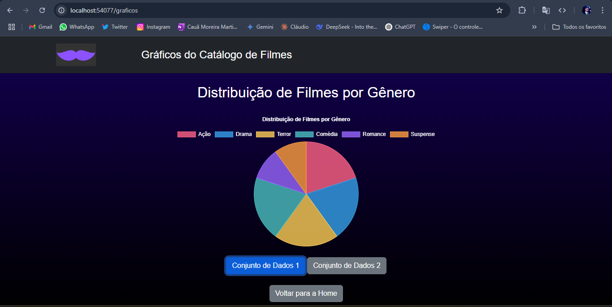
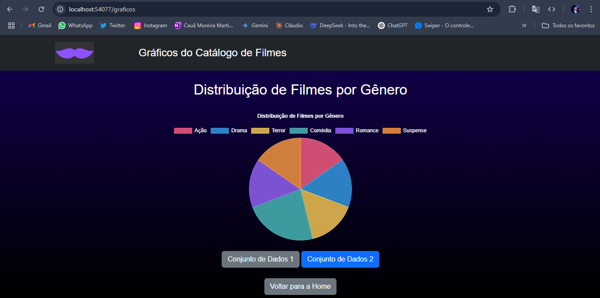

# Trabalho Prático - Semana 14

A partir dos dados cadastrados na etapa anterior, vamos trabalhar formas de apresentação que representem de forma clara e interativa as informações do seu projeto. Você poderá usar gráficos (barra, linha, pizza), mapas, calendários ou outras formas de visualização. Seu desafio é entregar uma página Web que organize, processe e exiba os dados de forma compreensível e esteticamente agradável.

Com base nos tipos de projetos escohidos, você deve propor **visualizações que estimulem a interpretação, agrupamento e exibição criativa dos dados**, trabalhando tanto a lógica quanto o design da aplicação.

Sugerimos o uso das seguintes ferramentas acessíveis: [FullCalendar](https://fullcalendar.io/), [Chart.js](https://www.chartjs.org/), [Mapbox](https://docs.mapbox.com/api/), para citar algumas.

## Informações do trabalho

- Nome: Matheus H Dias
- Matricula: 881586
- Proposta de projeto escolhida: Catalogo de filmes.
- Breve descrição sobre seu projeto: Catalogo de filmes com cartazes de filmes classicos.

**Print da tela com a implementação**

<< Nesta etapa, foi criada uma nova página HTML (graficos.html) para apresentar visualmente os dados do catálogo de filmes de forma dinâmica e interativa.

Utilizei a biblioteca Chart.js para gerar um gráfico de pizza, que exibe a quantidade de filmes por gênero (como Ação, Comédia, Drama, etc.). Os dados utilizados foram simulados com base nas informações cadastradas anteriormente por meio da funcionalidade de CRUD.

O gráfico é responsivo, possui título e cores distintas para facilitar a compreensão. Também foram realizados testes com dois conjuntos diferentes de dados, e os resultados foram documentados por meio de capturas de tela (prints), incluídas no README.md.

Essa visualização permite ao usuário interpretar facilmente a distribuição de filmes por gênero, unindo lógica, dados em JSON e design visual para enriquecer a experiência do projeto. >>

<<  >>

<<  >>
